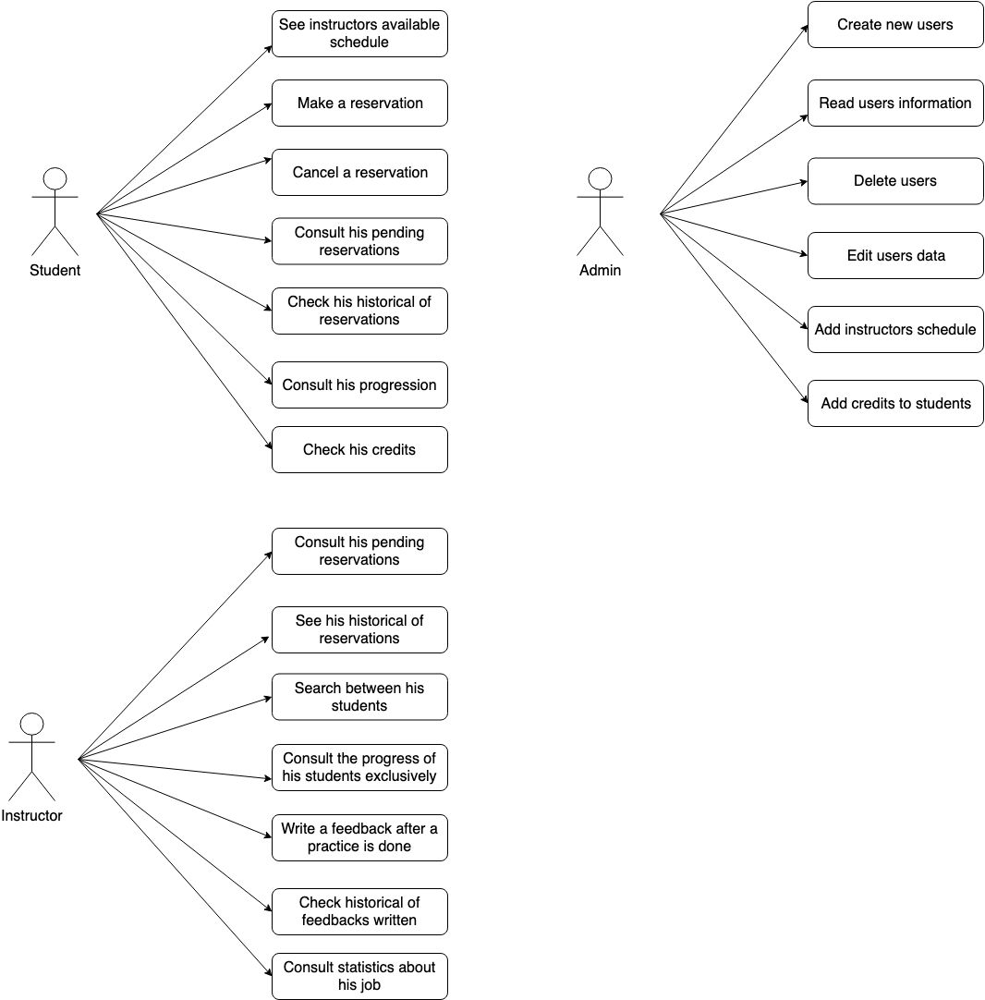
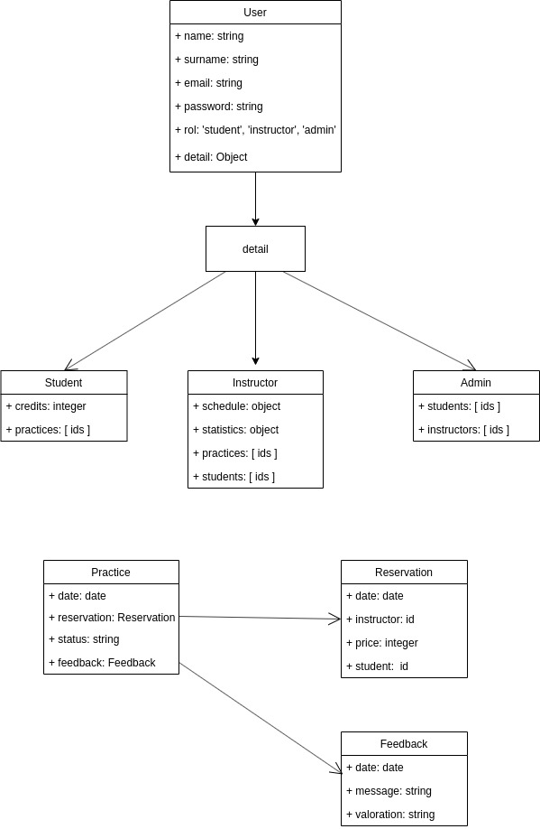

# Wheely

## Introduction

Wheely is an application born from a real need in driving schools. This tool pretends to make easier the daily job of booking a practice.

This application allows the student to book a practice with any instructor in any available time thanks to a system of online reservations and reviews in real time that can be consulted by both teachers and students.

## Functional Description

### Use Cases

### Flow Diagram

<!--  -->

## Technical Description

### Data model

### Block Diagram

<!--  -->

## Components

<!--  -->

### Components-React

<!--  -->

### Flow Components-React

<!--  -->

## Code Coverage

<!--  -->