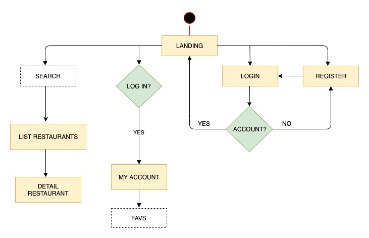

# Eat The World

## Introduction

Eat The World is a SPA.

The app bring information of restaurants around the world when the user specifies a city and a type of food. 
The user can also register, create an account and select favourite restaurants that the app will save into 'My account' section.  

The app is developed with React. The layout has been done with SASS.

## Functional Description

## Technical Description

// TODO